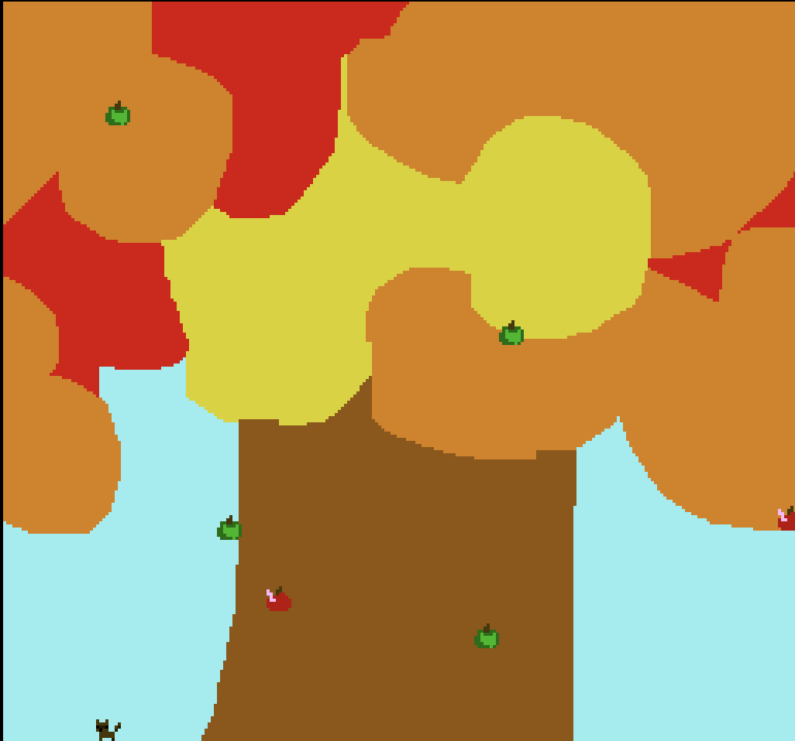

# Ravenous Raccoon Rush

Author: Charvi Hoysal (choysal)

Design: This game involves a raccoon that tries to catch as many falling apples from a tree as possible. There are good apples and bad apples that are randomly generated in different parts of the tree - catch the good ones and avoid the bad!

Screen Shot:

How My Asset Pipeline Works:

asset_gen.py is a python script that processes all the game source assets into necessary data that is passed through the pipeline and loaded into the PPU.

This script reads the pngs for the background, player sprite, and 2 additional sprites and stores them into numpy arrays. 
These arrays are passed into a function, find_tiles_and_palettes, that creates the palette and tile tables based on these images. 

First, all unique 8x8 tiles are stored
Then, all unique palettes are stored. Duplicates are removed, and pallets that can be reduced (ex dfferent orders) are condensed (to fit the 8 pallete limit)
If a pallete has less than 4 colors, additional duplicate colors are padded to the end
The background grid is created in the format specified for the PPU (following graphic from PPU466.hpp):
	#  bits:  F E D C B A 9 8 7 6 5 4 3 2 1 0
	#        |---------|-----|---------------|
	#            ^        ^        ^-- tile index
	#            |        '----------- palette index
	#            '-------------------- unused (set to zero)

Then, the palette table is created
Then, the tile table is created, using a dictionary created earlier to match the palettes to the tiles (to write into bit0 and bit1 for the tiles)
Finally, all the tables (backround, tile, palette) are written to bin files that are put in a directory and written to disk, as well as png representations of the palettes and tiles.

once this side of the pipeline is done, to read into the PPU, the bin data for the tile table, palette table, and background are read into the ppu.tile_table, ppu.palette_table, and ppu.backround data accordingly.

Now, since the PPU has access to it:
the background can be drawn
the player and additional sprites can be drawn, given the attribute value and the index value of the palette and tile locations in the tables after the pipeline processed the source files (these are added to the end, after the background palettes and tiles).

Additional Credit:

the asset_gen.py file used in the pipeline is largley authored by jmarkaba@andrew.cmu.edu, and then 
mandyh@andrew.cmu.edu and I worked together to conceptualize how to modify the file to our individual
needs- though we had different games, we worked together so the general idea of the additions are similar.

Source files (authored by me (choysal) using gimp):

[background](assets/bg_final.png)
[raccoon sprite](assets/raccoon_new.png)
[good apple sprite](assets/good_apple.png)
[bad apple sprite](assets/bad_apple.png)

How To Play:

Player can move left and right on the bottom of the screen.
Apples will fall from the tree from randomly generated points, move side to side to catch them!
Avoid red apples with worms in them, aim to catch green apples.

This game was built with [NEST](NEST.md).

